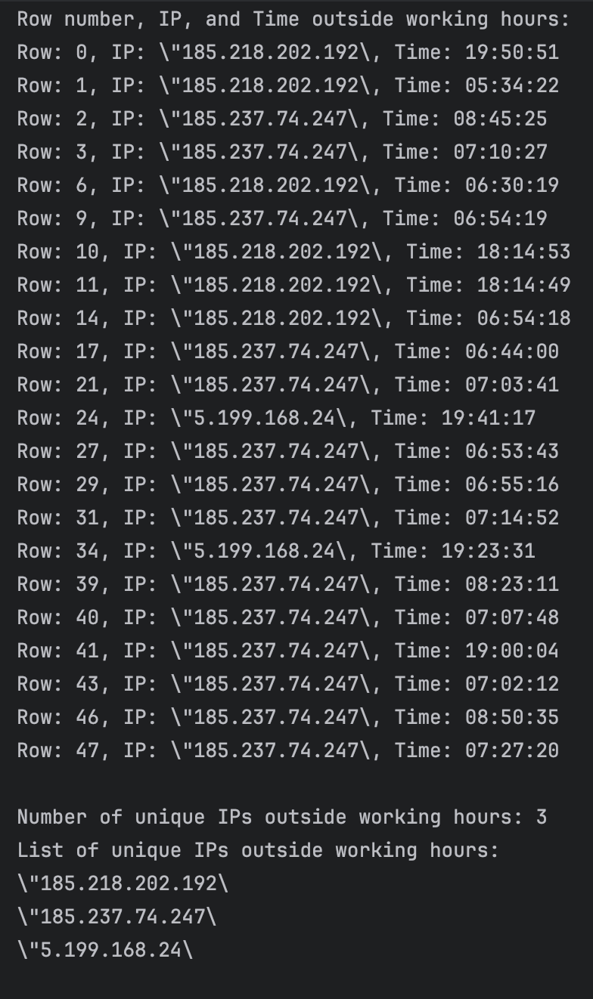

# soc_audit

This script is for the SOC audit team to automate the process of checking the status of the security tools on the endpoints.
The script will check the all endpoints and will generate a report in the form of plain text. 

## Getting Started
just run as it is... All links are hardcoded in the script.
```shell
python3 soc_audit.py
```

### Prerequisites
Python 3.6 or above 
preinstalled modules: (check requirements.txt)

### known issues
```text 
NotOpenSSLWarning: urllib3 v2 only supports OpenSSL 1.1.1+, currently the 'ssl' module is compiled with 'LibreSSL 2.8.3'. See: https://github.com/urllib3/urllib3/issues/3020
  warnings.warn(
 ```
This error can be ignored. It is a warning from the urllib3 module.

### Expected output

